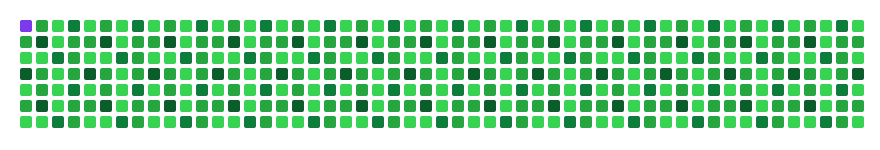

    <h1>Welcome aboard my <code>space station</code> 🛰️👨‍🚀</h1>

- 🔭 I’m currently working at [Adventure Dhaka Ltd.][Adventure Dhaka Ltd.] as Senior Software Engineer  
- 🌱 My current tech stack includes PHP, React.js, JavaScript  
- 🌱 Currently assimilating Next.js  
- 🌱 Seeking to improve my skills and eager to learn cool stuff daily!  
- 👯 I’m looking to collaborate on open-source projects  
- 💬 Ask me about anything related to Web Applications  
- ⚡ Fun fact: I am a social media freak :P  

---

### 📫 Connect with me  

  
  

---

---

### 🔥 Most Used Languages

  

    
PHP

    

      

    

    
95%

  

  

    
Laravel

    

      

    

    
92%

  

  

    
JavaScript

    

      

    

    
40%

  

  

    
Golang

    

      

    

    
25%

  

  

    
CSS

    

      

    

    
13.69%

  

  

    
HTML

    

      

    

    
11.88%

  

---

## 💼 Skills  

### Languages & Frameworks  

  
  
  
  
  
  
  
  
  
  
  
  
  
  

---

### Tools  

  
  
  
  
  
  
  

 
---

[Adventure Dhaka Ltd.]: https://jp.adventurekk.com/